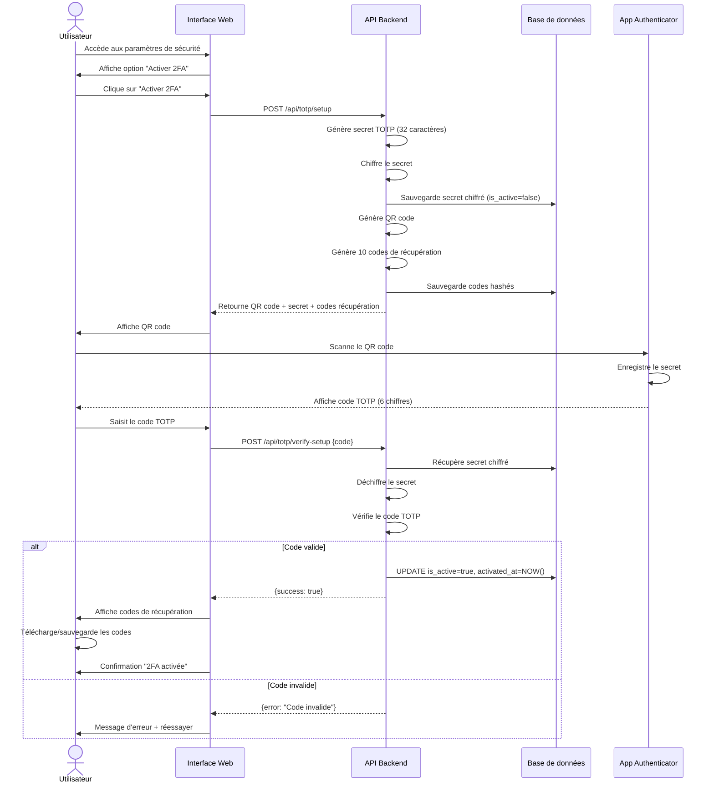
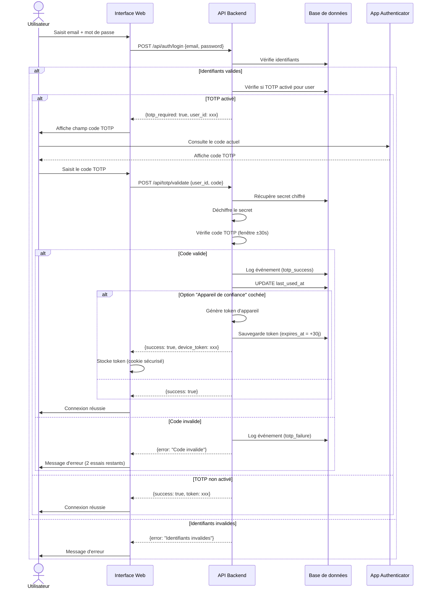
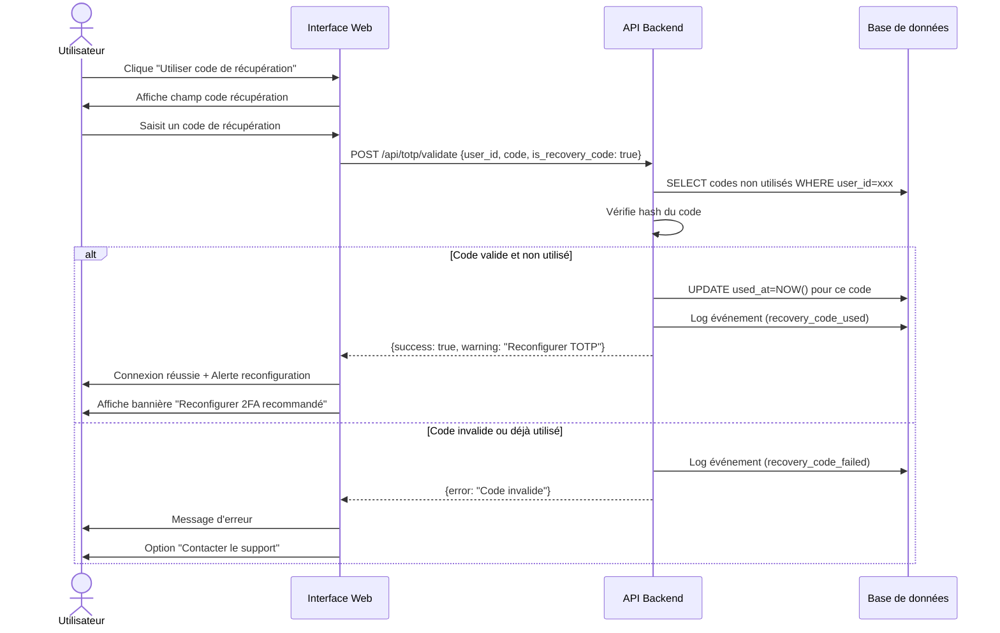
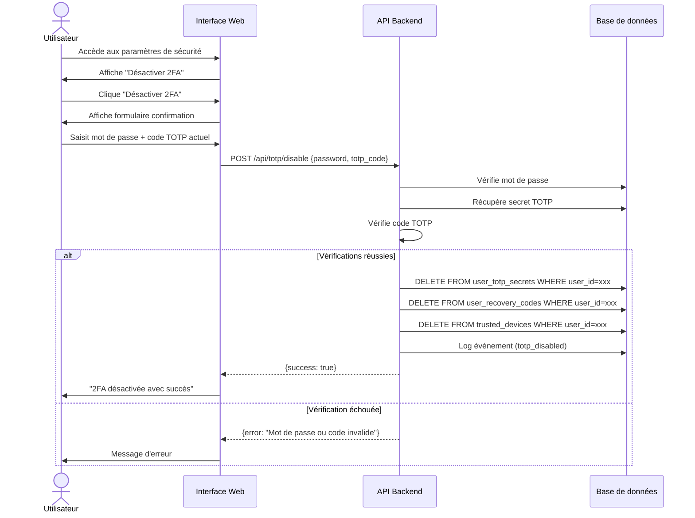
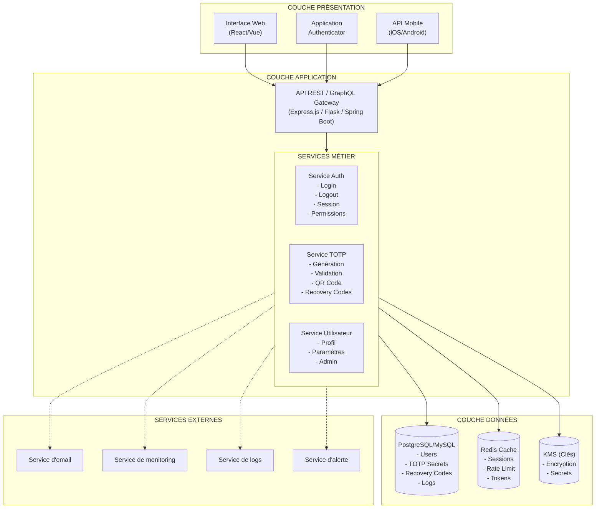
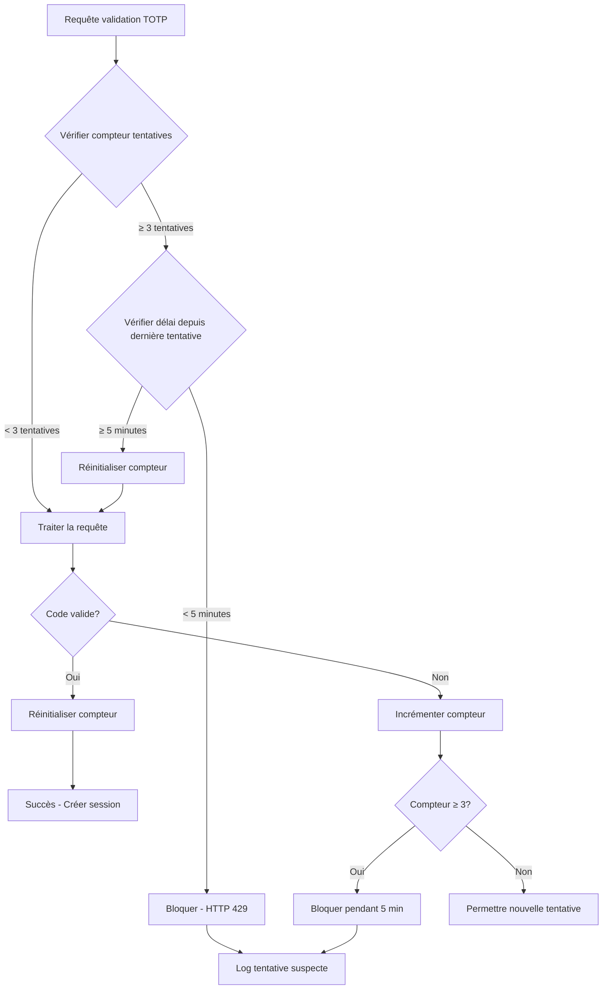
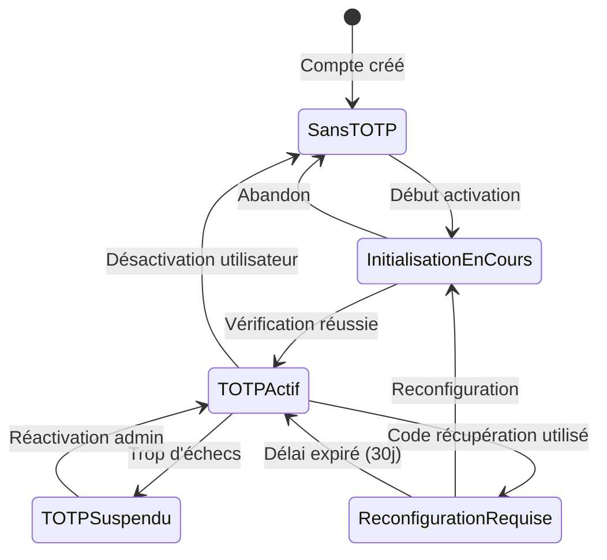
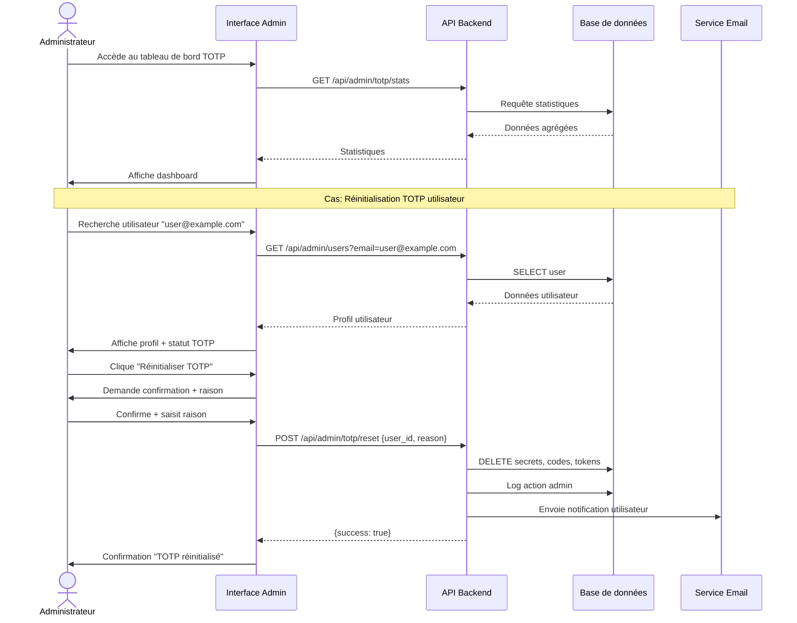

# Diagrammes de Flux - TOTP Kelio RH

## 1. Flux d'Activation TOTP

## 2. Flux de Connexion avec TOTP

## 3. Flux d'Utilisation d'un Code de Récupération

## 4. Flux de Désactivation TOTP

## 5. Diagramme d'Architecture Système

┌─────────────────────────────────────────────────────────────────────┐
│                         COUCHE PRÉSENTATION                          │
├─────────────────────────────────────────────────────────────────────┤
│                                                                      │
│  ┌──────────────────┐  ┌──────────────────┐  ┌──────────────────┐  │
│  │  Interface Web   │  │  Application     │  │  API Mobile      │  │
│  │  (React/Vue)     │  │  Authenticator   │  │  (iOS/Android)   │  │
│  └────────┬─────────┘  └────────┬─────────┘  └────────┬─────────┘  │
│           │                     │                     │             │
└───────────┼─────────────────────┼─────────────────────┼─────────────┘
            │                     │                     │
            │         HTTPS/TLS   │                     │
            └─────────────────────┼─────────────────────┘
                                  │
┌─────────────────────────────────┼─────────────────────────────────┐
│                         COUCHE APPLICATION                         │
├─────────────────────────────────┼─────────────────────────────────┤
│                                 │                                  │
│  ┌──────────────────────────────▼──────────────────────────────┐  │
│  │              API REST / GraphQL Gateway                     │  │
│  │              (Express.js / Flask / Spring Boot)             │  │
│  └──────────────────────────────┬──────────────────────────────┘  │
│                                 │                                  │
│  ┌──────────────────────────────▼──────────────────────────────┐  │
│  │                    SERVICES MÉTIER                          │  │
│  ├──────────────────┬──────────────────┬──────────────────────┤  │
│  │ Service Auth     │ Service TOTP     │ Service Utilisateur  │  │
│  │ - Login          │ - Génération     │ - Profil             │  │
│  │ - Logout         │ - Validation     │ - Paramètres         │  │
│  │ - Session        │ - QR Code        │ - Admin              │  │
│  │ - Permissions    │ - Recovery Codes │                      │  │
│  └──────────────────┴──────────────────┴──────────────────────┘  │
│                                                                    │
└────────────────────────────────┬───────────────────────────────────┘
                                 │
┌────────────────────────────────▼───────────────────────────────────┐
│                         COUCHE DONNÉES                             │
├────────────────────────────────────────────────────────────────────┤
│                                                                     │
│  ┌─────────────────┐  ┌─────────────────┐  ┌─────────────────┐   │
│  │ PostgreSQL/MySQL│  │  Redis Cache    │  │  KMS (Clés)     │   │
│  │ - Users         │  │  - Sessions     │  │  - Encryption   │   │
│  │ - TOTP Secrets  │  │  - Rate Limit   │  │  - Secrets      │   │
│  │ - Recovery Codes│  │  - Tokens       │  │                 │   │
│  │ - Logs          │  │                 │  │                 │   │
│  └─────────────────┘  └─────────────────┘  └─────────────────┘   │
│                                                                     │
└─────────────────────────────────────────────────────────────────────┘

┌─────────────────────────────────────────────────────────────────────┐
│                      SERVICES EXTERNES                              │
├─────────────────────────────────────────────────────────────────────┤
│  - Service d'email (notifications)                                  │
│  - Service de monitoring (Datadog, New Relic)                       │
│  - Service de logs (ELK Stack, Splunk)                              │
│  - Service d'alerte (PagerDuty)                                     │
└─────────────────────────────────────────────────────────────────────┘

## 6. Flux de Sécurité - Rate Limiting

## 7. Diagramme d'États - Compte Utilisateur TOTP

## 8. Flux de Gestion Admin

---

**Note** : Ces diagrammes peuvent être visualisés avec des outils compatibles Mermaid comme :
- GitHub (rendu automatique des blocs mermaid)
- Mermaid Live Editor (https://mermaid.live)
- Extensions VSCode (Mermaid Preview)
- GitLab, Notion, Confluence

**Version** : 1.0  
**Date** : Octobre 2025
